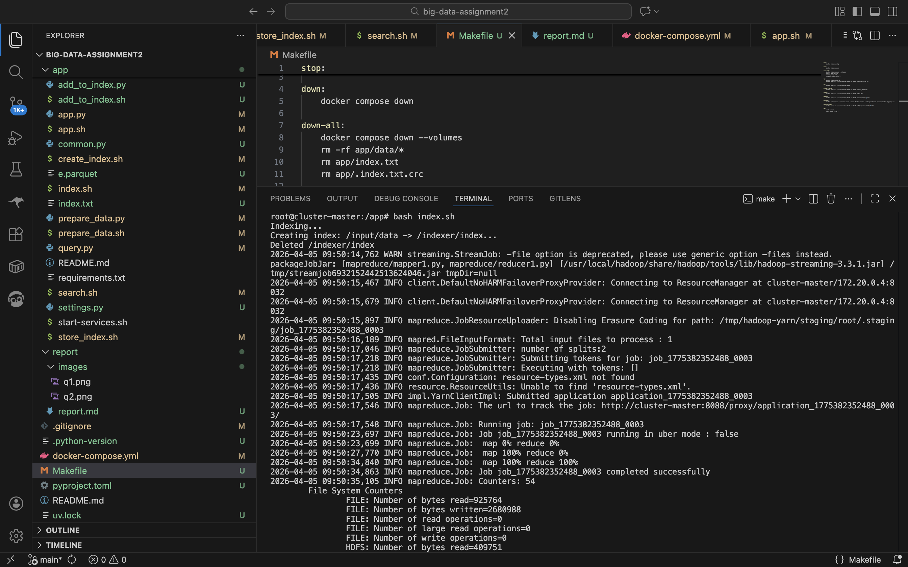
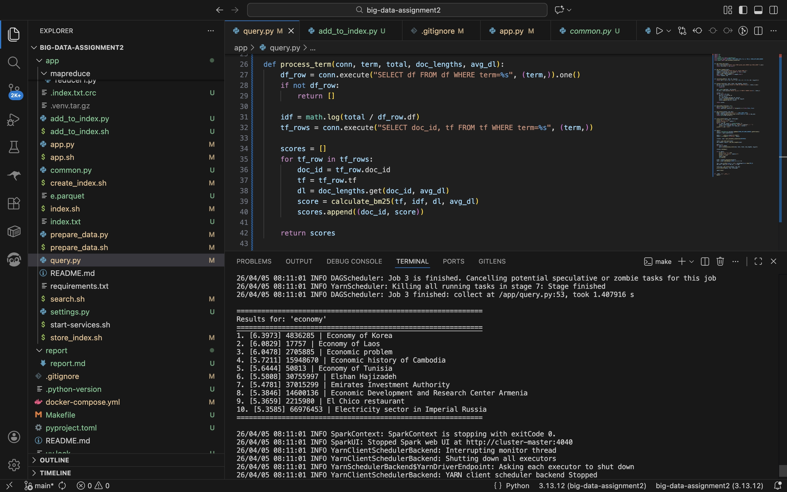
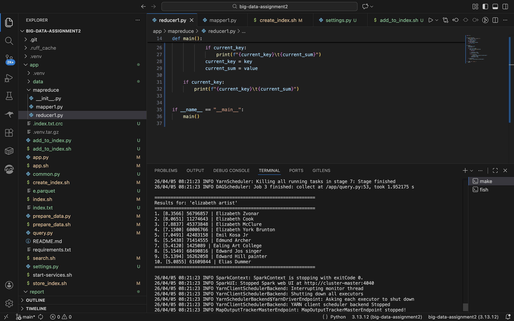

# Big Data Assignment 2: Distributed Search Engine

## By: Aleksandr Mikhailov AI-01
`al.mikhailov@innopolis.university`

---

## Methodology

### System Architecture

The system uses Docker Compose to deploy:
- **cluster-master**: Hadoop master (NameNode, ResourceManager) + Spark master
- **cluster-slave-1**: Hadoop worker (DataNode, NodeManager)
- **cassandra-server**: Cassandra/ScyllaDB for index storage

```
Parquet File → HDFS → MapReduce Indexer → Cassandra/ScyllaDB
                                                    ↑
User Query → Spark Ranker ───────────────────────────┘
```

### Data Preparation

Implemented in [`prepare_data.py`](../app/prepare_data.py):

1. Read parquet file containing Wikipedia articles (id, title, text)
2. Sample 100 documents using PySpark
3. Save each document as `<doc_id>_<doc_title>.txt`
4. Transform to tab-separated format and store in HDFS at `/input/data`:
   ```
   <doc_id>\t<doc_title>\t<doc_text>
   ```

### Indexing with Hadoop MapReduce

The design patter to implement the indexing is In-Mapper aggregation. This method was chosen because it significantly reduces the memory strain (at least on my system) in contrast to the standatd MapReduce approach.

<div style="page-break-before:always"></div>

**Mapper** ([`mapper1.py`](../app/mapreduce/mapper1.py)):
- Extracts terms using regex `[a-z0-9]+`
- Emits key-value pairs:
  - `DL:<doc_id>\t<length>` - document length
  - `DOCS_COUNT\t1` - document counter
  - `TF:<term>@<doc_id>\t<count>` - term frequency
  - `DF:<term>\t1` - document frequency
  - `TT:<doc_id>\t<title>` - document title (it is cleaned to include only ascii characters)

**Reducer** ([`reducer1.py`](../app/mapreduce/reducer1.py)):
- Aggregates values for each key
- Computes final TF, DF, DL, TT, and total document count

### Index Storage in Cassandra/ScyllaDB

Implemented in [`app.py`](../app/app.py), creates four tables:

| Table | Purpose | Primary Key |
|-------|---------|-------------|
| `global_data` | Total document count | `key` |
| `dl` | Document lengths | `doc_id` |
| `df` | Document frequencies | `term` |
| `tf` | Term frequencies | `(term, doc_id)` |
| `docs` | Document titles | `doc_id` |

Data is loaded from merged MapReduce output using prepared statements with async inserts for performance.

<div style="page-break-before:always"></div>

#### Indexing Results



### BM25 Ranking Algorithm

Implemented in [`query.py`](../app/query.py):

```
BM25(q,d) = Σ IDF(t) × (tf × (k1 + 1)) / (tf + k1 × (1 - b + b × (dl / avg_dl)))
```

Parameters:
- `k1 = 1.0` (term frequency saturation)
- `b = 0.75` (length normalization)
- `IDF(t) = log(N / df(t))`

### Query Processing

1. Parse query terms using regex
2. For each term, retrieve documents from Cassandra and compute BM25 scores
3. Aggregate scores per document using Spark RDD `reduceByKey`
4. Sort and return top 10 results

I have encountered a very frustratin issue with Cassandra server. It was constantly running out of memory and crashing, so I had to restart the containers or my machine just to run indexing and search.

### Dynamic Index Updates

[`add_to_index.py`](../app/add_to_index.py) allows adding new documents without full re-indexing:
- Updates total document count
- Adds document length
- Updates term and document frequencies

---

## Documentation

Explore [Makefile](../Makefile) for the prepared scripts in my implementation. Mainly, they allow to run the node cluster, index the data, and run the search engine.

I have used `e.parquet` file, you will need to manually download it to `app` directory, since I couldn't get git lfs to work.

---

### Configuration (app/settings.py)

| Parameter | Value | Description |
|-----------|-------|-------------|
| `SAMPLE_LIMIT` | 1500 | Documents to index |
| `TOP_K` | 10 | Results to return |
| `K1` | 1.0 | BM25 parameter |
| `B` | 0.75 | BM25 parameter |
| `KEYSPACE` | query_engine | Cassandra keyspace |

---

### Query Demonstration

#### Query 1: "economy"



**Analysis**: Exact match about Korean economy receives highest score; related and similar economic documents follow.

<div style="page-break-before:always"></div>

#### Query 2: "elizabeth artist"



**Analysis**: Documents with "elizabeth" in title/content rank highest. Notably, the highest ranking entry is about Elizabeth Sonar, a Canadian contemporary artist.

---

### Design Choices

- **Single pipeline**: Simple and sufficient for this scale
- **Tab-separated format**: Easy to parse, compatible with streaming
- **Separate Cassandra tables**: Optimizes query patterns
- **Async inserts**: Improves loading performance

### Potential Improvements

- Add stemming/lemmatization for better term matching
- Implement stop word removal
- Add query result caching
- Shard Cassandra cluster for larger datasets

### Challenges

- Docker cluster configuration required careful setup
- Data format consistency between components
- Python environment packaging for Spark YARN
- Cassandra server crashing with out of memory
